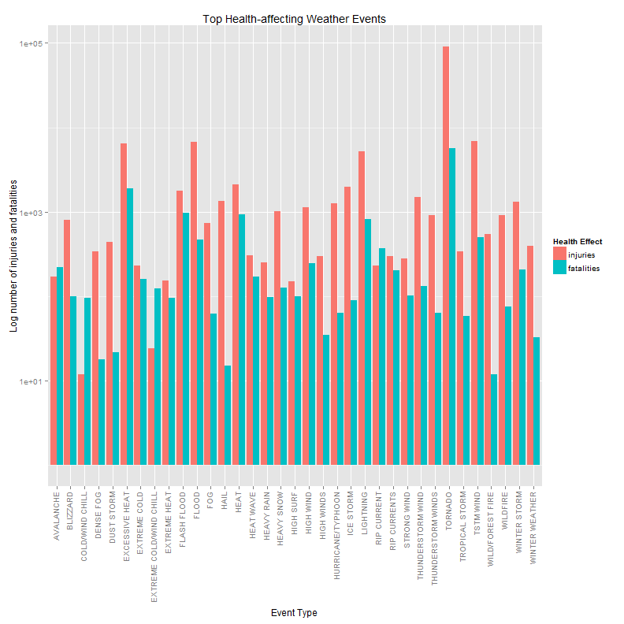

An Exploration of Severe Weather Events: NOAA Storm Data, 1950 - 2011
=====================================================================

## Synopsis

summary analysis / results; no more than 10 sentences

## Data Processing

### Preprocessing

Before processing and analysis, we must first obtain the data:


```r
## set WD on local machine to the location of this Rmd file; setup data dir
setwd("C:/Users/570815/Dropbox/Coursera/R Working Directory/RepData_PeerAssessment2")
zipURL <- "https://d396qusza40orc.cloudfront.net/repdata%2Fdata%2FStormData.csv.bz2"
if (!file.exists("./data")) {
    dir.create("./data")
}
```


To download on Windows [try() wrapper is to suppress superfluous Error message
produced when knitting]:


```r
try(download.file(zipURL, destfile = "./data/NOAAdata.csv.bz2"))
dateDownloaded <- date()
```


To download on Mac:


```r
download.file(zipURL, destfile = "./data/NOAAdata.csv.bz2", method = "curl")
dateDownloaded <- date()
```


After downloading is complete, we can read the data into R. Testing the connection 
to the bz2 file, we see that the values are conveniently comma-separated:


```r
testcon <- bzfile("./data/NOAAdata.csv.bz2")
open(testcon)
readLines(testcon, n = 3)
```

```
## [1] "\"STATE__\",\"BGN_DATE\",\"BGN_TIME\",\"TIME_ZONE\",\"COUNTY\",\"COUNTYNAME\",\"STATE\",\"EVTYPE\",\"BGN_RANGE\",\"BGN_AZI\",\"BGN_LOCATI\",\"END_DATE\",\"END_TIME\",\"COUNTY_END\",\"COUNTYENDN\",\"END_RANGE\",\"END_AZI\",\"END_LOCATI\",\"LENGTH\",\"WIDTH\",\"F\",\"MAG\",\"FATALITIES\",\"INJURIES\",\"PROPDMG\",\"PROPDMGEXP\",\"CROPDMG\",\"CROPDMGEXP\",\"WFO\",\"STATEOFFIC\",\"ZONENAMES\",\"LATITUDE\",\"LONGITUDE\",\"LATITUDE_E\",\"LONGITUDE_\",\"REMARKS\",\"REFNUM\""
## [2] "1.00,4/18/1950 0:00:00,\"0130\",\"CST\",97.00,\"MOBILE\",\"AL\",\"TORNADO\",0.00,,,,,0.00,,0.00,,,14.00,100.00,\"3\",0.00,0.00,15.00,25.00,\"K\",0.00,,,,,3040.00,8812.00,3051.00,8806.00,,1.00"                                                                                                                                                                                                                                                                                       
## [3] "1.00,4/18/1950 0:00:00,\"0145\",\"CST\",3.00,\"BALDWIN\",\"AL\",\"TORNADO\",0.00,,,,,0.00,,0.00,,,2.00,150.00,\"2\",0.00,0.00,0.00,2.50,\"K\",0.00,,,,,3042.00,8755.00,0.00,0.00,,2.00"
```

```r
close(testcon)
```


As this is the case, we can use read.csv() to read the data into R:


```r
## takes a while to read - roughly 33 million data points
sd <- read.csv("./data/NOAAdata.csv.bz2")
```


The storm data are now loaded and can be processed for analysis.

### Processing for Analysis

There are two key questions we are trying to answer in our analysis:

1. Across the United States, which types of events (as indicated in the EVTYPE 
variable) are most harmful with respect to population health?

2. Across the United States, which types of events have the greatest economic 
consequences?

We will begin our analysis with the first question. The variables of interest to 
us in the dataset for looking at population health are fatalities and injuries. 
The following code obtains the total number of injuries and fatalities by event 
type:


```r
library(plyr)
## may take a little bit of time to execute the ddply operation
healthDF <- ddply(sd, .(EVTYPE), summarize, injuries = sum(INJURIES, na.rm = T), 
    fatalities = sum(FATALITIES, na.rm = T))
```


We can quickly examine some of the "most harmful" events as categorized by 
causing injury and/or fatality, noting that a few of the top items are the same:


```r
healthDF <- as.data.frame(healthDF)
## top 5 events causing injuries:
topInjury <- healthDF[with(healthDF, order(injuries, fatalities, decreasing = TRUE)), 
    ]
head(topInjury, 5)
```

```
##             EVTYPE injuries fatalities
## 834        TORNADO    91346       5633
## 856      TSTM WIND     6957        504
## 170          FLOOD     6789        470
## 130 EXCESSIVE HEAT     6525       1903
## 464      LIGHTNING     5230        816
```

```r
## top 5 events causing fatalities:
topFatality <- healthDF[with(healthDF, order(fatalities, injuries, decreasing = TRUE)), 
    ]
head(topFatality, 5)
```

```
##             EVTYPE injuries fatalities
## 834        TORNADO    91346       5633
## 130 EXCESSIVE HEAT     6525       1903
## 153    FLASH FLOOD     1777        978
## 275           HEAT     2100        937
## 464      LIGHTNING     5230        816
```


To get a better sense of the most harmful events to human health, we can do a 
bit more processing of the injury and fatality data to obtain a shared set of 
events, which we will plot in the Results section below:


```r
## obtain the top 25 most-harmful effects as indicated by injuries /
## fatalities
top25i <- as.character(topInjury$EVTYPE[1:25])
top25f <- as.character(topFatality$EVTYPE[1:25])
## take the unique values from these top lists
topEventNames <- unique(c(top25i, top25f))
## subset the health effects events on this set of most-harmful events
topHealthEvents <- healthDF[healthDF$EVTYPE %in% as.factor(topEventNames), ]
```


Now we turn to the second question.  The data processing here is somewhat more 
laborious as the values for economic damage are split into numerals and units which 
give their levels (thousands, millions, billions).

First we need to obtain the subset of relevant storm data containing information on 
events, property and crop damage amounts, and the "units" of those amounts:


```r
## subset the storm data set to the economic damage variables of interest
subSD <- sd[, c("EVTYPE", "PROPDMG", "PROPDMGEXP", "CROPDMG", "CROPDMGEXP")]
## define the valid tags that allow us to determine the damage values
validTags <- c("b", "B", "k", "K", "m", "M")
## subset further only on entries where a valid unit tag is present in the
## data
subSD <- subSD[as.character(subSD$PROPDMGEXP) %in% validTags & as.character(subSD$CROPDMGEXP) %in% 
    validTags, ]
```


Having obtained the subset, we now address the issue of combining the units with their 
respective values.  First, we re-level the units for property and crop damage values:


```r
## re-level the property damage tags
levels(subSD$PROPDMGEXP)[levels(subSD$PROPDMGEXP) == "B"] <- "1000000000"
levels(subSD$PROPDMGEXP)[levels(subSD$PROPDMGEXP) == "M"] <- "1000000"
levels(subSD$PROPDMGEXP)[levels(subSD$PROPDMGEXP) == "m"] <- "1000000"
levels(subSD$PROPDMGEXP)[levels(subSD$PROPDMGEXP) == "K"] <- "1000"
## re-level the crop damage tags
levels(subSD$CROPDMGEXP)[levels(subSD$CROPDMGEXP) == "B"] <- "1000000000"
levels(subSD$CROPDMGEXP)[levels(subSD$CROPDMGEXP) == "M"] <- "1000000"
levels(subSD$CROPDMGEXP)[levels(subSD$CROPDMGEXP) == "m"] <- "1000000"
levels(subSD$CROPDMGEXP)[levels(subSD$CROPDMGEXP) == "K"] <- "1000"
levels(subSD$CROPDMGEXP)[levels(subSD$CROPDMGEXP) == "k"] <- "1000"
```


Next, we combine the units and values via simple multiplication:


```r
subSD$property.dmg <- with(subSD, PROPDMG * as.numeric(as.character(PROPDMGEXP)))
subSD$crop.dmg <- with(subSD, CROPDMG * as.numeric(as.character(CROPDMGEXP)))

# econDF <- a subset of sd on select variables, similar to healthDF
```


once i hvae these data figured out, can do some analysis and come up with a useful sort of plot; maybe just as simple as a version of the other one OR maybe better to do a panel plot to mix things up / do a slightly different type of analysis


## Results

### Health-affecting Events

Based on the analysis of health effects caused by weather events in the prior section, 
we can construct the following plot of the weather events that are most harmful to human 
health, to give a clearer sense of which events we might want to focus our efforts on 
in terms of emergency preparation. Note that the y-axis on this graph is plotted on a 
logarithmic scale, as Tornado injuries were significantly greater in magnitude than all 
other event injuries.


```r
library(reshape2)
library(ggplot2)
moltenHealth <- melt(topHealthEvents, id.vars = ("EVTYPE"))
ggplot(moltenHealth, aes(x = EVTYPE, y = value)) + geom_bar(aes(fill = variable), 
    position = "dodge") + scale_y_log10() + theme(axis.text.x = element_text(size = 10, 
    angle = 90, hjust = 1, vjust = 0.25)) + labs(title = "Top Health-affecting Weather Events", 
    x = "Event Type", y = "Log number of injuries and fatalities") + scale_fill_discrete(name = "Health Effect")
```

 


Looking at this plot, we can make a few observations. While the most harmful weather 
events typically cause more injuries than fatalities, those related to cold and wind chill 
actually cause more fatalities than injuries -- priority remediation activities may need 
to be devised for these events that are generally more fatal than simply injurious. 

The most harmful event types overall can also be clearly seen here -- tornadoes, heat, 
floods, lightning, tropical storm winds, and winter storms (this lattermost likely to be 
associated with the cold and wind chill events as well) are among the events with the 
greatest negative impact on human health.

This analysis is simplistic in that it does not account for potential changes in injuries 
and fatalities by weather event type over time (due to circumstantial changes or simply 
data collection changes), and lengthier exploration of the data could reveal a different 
set of weather events that are most harmful to human health. This simplistic analysis 
still gives us some order-of-magnitude feel for the harmfulness of weather events on 
the basis of aggregate data, however.

### Economy-affecting Events


figures can go here; must have at least 1 figure containing a plot, and no more than 3

(maybe keep processing code up above to get healthDF / econDF datasets, then do plotting code here + written explanation of what we're looking at in the plots)

## Wrap-up / final notes

maybe?


