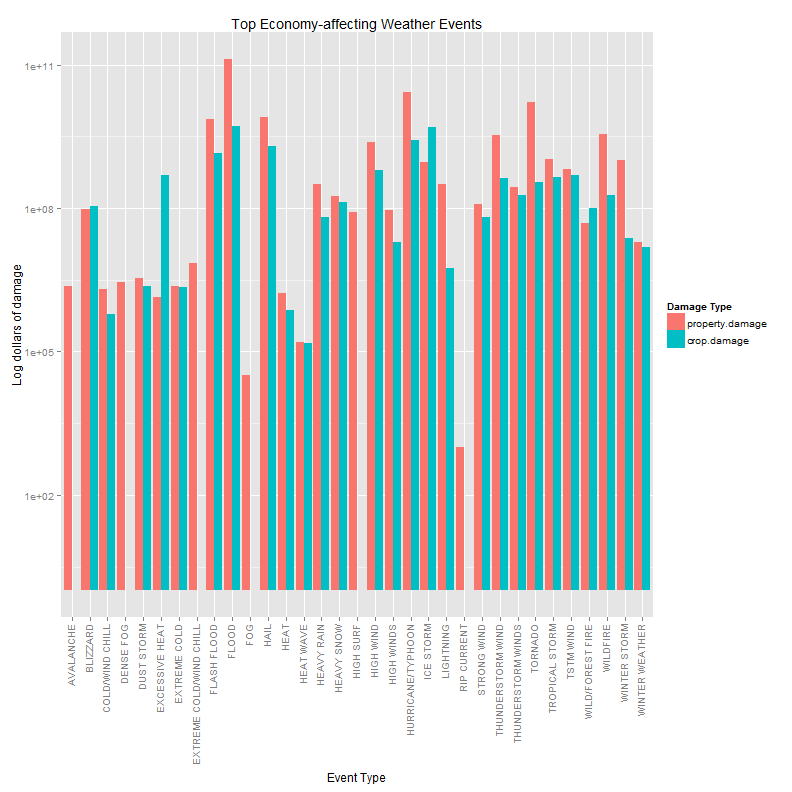

An Exploration of The Effects of Severe Weather Events on Human Health and the Economy: NOAA Storm Data, 1950 - 2011
============================

## Synopsis

This analysis examines data on severe weather events collected in the U.S. National 
Oceanic and Atmospheric Administration's storm database to determine which types of events 
are most harmful to human health and the economy. The analysis obtains subsets 
of the storm database containing aggregate total effects by weather event type in the 
two broad categories of health effects and economic effects. The aggregate data for health 
effects are further broken down into injury and fatality data, and for economic effects 
they are broken down into property and crop damage data. Results are presented in both 
graphical and tabular format for each, with surrounding discussion. 

This analysis is simplistic in its historical-aggregation approach, and a subsequent 
time-series-based approach to analyzing the same data could prove fruitful in identifying 
which of the "most harmful" weather events may be of greatest contemporary relevance. The 
analysis presented herein is still valuable as an approach to addressing the questions of 
which event types are most damaging with respect to the broad parameters of interest, but 
it should be kept in mind throughout that the time dimension has been abstracted away.

## Data Processing

### Preprocessing

Before processing and analysis, we must first obtain the data:


```r
## set WD on local machine to the location of this Rmd file; setup data dir
setwd("C:/Users/570815/Dropbox/Coursera/R Working Directory/RepData_PeerAssessment2")
zipURL <- "https://d396qusza40orc.cloudfront.net/repdata%2Fdata%2FStormData.csv.bz2"
if (!file.exists("./data")) {
    dir.create("./data")
}
```


To download on Windows [try() wrapper is to suppress superfluous Error message
produced when knitting]:


```r
try(download.file(zipURL, destfile = "./data/NOAAdata.csv.bz2"))
dateDownloaded <- date()
```


To download on Mac:


```r
download.file(zipURL, destfile = "./data/NOAAdata.csv.bz2", method = "curl")
dateDownloaded <- date()
```


After downloading is complete, we can read the data into R. The values are 
conveniently comma-separated in the file, so we can use read.csv() to read the 
data:


```r
## takes a while to read - roughly 33 million data points
sd <- read.csv("./data/NOAAdata.csv.bz2")
```


The storm data are now loaded and can be processed for analysis.

### Processing for Analysis

There are two key questions we are trying to answer in our analysis:

1. Across the United States, which types of events (as indicated in the EVTYPE 
variable) are most harmful with respect to population health?

2. Across the United States, which types of events have the greatest economic 
consequences?

We will begin our analysis with the first question. The variables of interest to 
us in the dataset for looking at population health are fatalities and injuries. 
The following code obtains the total number of injuries and fatalities by event 
type:


```r
library(plyr)
## may take a little bit of time to execute the ddply operation
healthDF <- ddply(sd, .(EVTYPE), summarize, injuries = sum(INJURIES, na.rm = T), 
    fatalities = sum(FATALITIES, na.rm = T))
```


We can quickly examine some of the "most harmful" events as categorized by 
causing injury and/or fatality, noting that a few of the top items are the same:


```r
healthDF <- as.data.frame(healthDF)
## top 5 events causing injuries:
topInjury <- healthDF[with(healthDF, order(injuries, fatalities, decreasing = TRUE)), 
    ]
head(topInjury, 5)
```

```
##             EVTYPE injuries fatalities
## 834        TORNADO    91346       5633
## 856      TSTM WIND     6957        504
## 170          FLOOD     6789        470
## 130 EXCESSIVE HEAT     6525       1903
## 464      LIGHTNING     5230        816
```

```r
## top 5 events causing fatalities:
topFatality <- healthDF[with(healthDF, order(fatalities, injuries, decreasing = TRUE)), 
    ]
head(topFatality, 5)
```

```
##             EVTYPE injuries fatalities
## 834        TORNADO    91346       5633
## 130 EXCESSIVE HEAT     6525       1903
## 153    FLASH FLOOD     1777        978
## 275           HEAT     2100        937
## 464      LIGHTNING     5230        816
```


To get a better sense of the most harmful events to human health, we can do a 
bit more processing of the injury and fatality data to obtain a shared set of 
events, which we will plot in the Results section below. The cutoff point of top 
25 of each weather events is chosen non-scientifically for convienience and 
readability in the final plot:


```r
## obtain the top 25 most-harmful effects as indicated by injuries /
## fatalities
top25i <- as.character(topInjury$EVTYPE[1:25])
top25f <- as.character(topFatality$EVTYPE[1:25])
## take the unique values from these top lists
topEventNames <- unique(c(top25i, top25f))
## subset the health effects events on this set of most-harmful events
topHealthEvents <- healthDF[healthDF$EVTYPE %in% as.factor(topEventNames), ]
```


We also create a table of health effects by type, which will be used in the Results 
section:


```r
icols <- healthDF[healthDF$EVTYPE %in% top25i, c(1, 2)]
fcols <- healthDF[healthDF$EVTYPE %in% top25f, c(1, 3)]
icolsSorted <- icols[with(icols, order(injuries, decreasing = T)), ]
fcolsSorted <- fcols[with(fcols, order(fatalities, decreasing = T)), ]
sortedHealthDT <- cbind(as.matrix(icolsSorted), as.matrix(fcolsSorted))
colnames(sortedHealthDT) <- c("Event Type", "Injuries", "Event Type", "Fatalities")
```


Now we turn to the second question.  The data processing here is somewhat more 
laborious as the values for economic damage are split into numerals and units which 
give their levels (thousands, millions, billions).

First we need to obtain the subset of relevant storm data containing information on 
events, property and crop damage amounts, and the "units" of those amounts. We use only 
the data that present valid "tags" for the units, allowing us to translate them into 
thousands, millions, or billions of dollars worth of damage:


```r
## subset the storm data set to the economic damage variables of interest
subSD <- sd[, c("EVTYPE", "PROPDMG", "PROPDMGEXP", "CROPDMG", "CROPDMGEXP")]
## define the valid tags that allow us to determine the damage values
validTags <- c("b", "B", "k", "K", "m", "M")
## subset further only on entries where a valid unit tag is present in the
## data
subSD <- subSD[as.character(subSD$PROPDMGEXP) %in% validTags & as.character(subSD$CROPDMGEXP) %in% 
    validTags, ]
```


Having obtained the subset, we now address the issue of combining the units with their 
respective values.  First, we re-level the units for property and crop damage values:


```r
## re-level the property damage tags
levels(subSD$PROPDMGEXP)[levels(subSD$PROPDMGEXP) == "B"] <- "1000000000"
levels(subSD$PROPDMGEXP)[levels(subSD$PROPDMGEXP) == "M"] <- "1000000"
levels(subSD$PROPDMGEXP)[levels(subSD$PROPDMGEXP) == "m"] <- "1000000"
levels(subSD$PROPDMGEXP)[levels(subSD$PROPDMGEXP) == "K"] <- "1000"
## re-level the crop damage tags
levels(subSD$CROPDMGEXP)[levels(subSD$CROPDMGEXP) == "B"] <- "1000000000"
levels(subSD$CROPDMGEXP)[levels(subSD$CROPDMGEXP) == "M"] <- "1000000"
levels(subSD$CROPDMGEXP)[levels(subSD$CROPDMGEXP) == "m"] <- "1000000"
levels(subSD$CROPDMGEXP)[levels(subSD$CROPDMGEXP) == "K"] <- "1000"
levels(subSD$CROPDMGEXP)[levels(subSD$CROPDMGEXP) == "k"] <- "1000"
```


Next, we combine the units and values via simple multiplication, and then total 
the damage values by weather event type:


```r
library(plyr)
subSD$property.dmg <- with(subSD, PROPDMG * as.numeric(as.character(PROPDMGEXP)))
subSD$crop.dmg <- with(subSD, CROPDMG * as.numeric(as.character(CROPDMGEXP)))
## ddply operation may take a while to run even on the subset of storm data
econDF <- ddply(subSD, .(EVTYPE), summarize, property.damage = sum(property.dmg, 
    na.rm = T), crop.damage = sum(crop.dmg, na.rm = T))
```


With the economic damage data now aggregated, we can see which weather events have 
caused the most recorded economic damage in the dataset, to property and crops 
respectively:


```r
## top weather events causing property damage:
topProperty <- econDF[with(econDF, order(property.damage, crop.damage, decreasing = TRUE)), 
    ]
head(topProperty, 5)
```

```
##               EVTYPE property.damage crop.damage
## 23             FLOOD       1.328e+11   5.171e+09
## 61 HURRICANE/TYPHOON       2.674e+10   2.608e+09
## 98           TORNADO       1.617e+10   3.534e+08
## 56         HURRICANE       9.716e+09   2.689e+09
## 37              HAIL       7.992e+09   2.029e+09
```

```r
## top weather events causing crop damage:
topCrop <- econDF[with(econDF, order(crop.damage, property.damage, decreasing = TRUE)), 
    ]
head(topCrop, 5)
```

```
##               EVTYPE property.damage crop.damage
## 23             FLOOD       1.328e+11   5.171e+09
## 74       RIVER FLOOD       5.080e+09   5.029e+09
## 63         ICE STORM       9.030e+08   5.022e+09
## 56         HURRICANE       9.716e+09   2.689e+09
## 61 HURRICANE/TYPHOON       2.674e+10   2.608e+09
```


As was done for the health effect data, we can perform additional processing to 
obtain the most harmful economic events for plotting below in the Results section:


```r
## obtain the top 25 most-harmful effects as indicated by property / crop
## damage
top25p <- as.character(topProperty$EVTYPE[1:25])
top25c <- as.character(topCrop$EVTYPE[1:25])
## take the unique values from these top lists
topEventNames2 <- unique(c(top25i, top25f))
## subset the economic effects events on this set of most-harmful events
topEconEvents <- econDF[econDF$EVTYPE %in% as.factor(topEventNames2), ]
```


Lastly, we will create a table of economic damage by type, which will be used in 
the Results section:


```r
pcols <- econDF[econDF$EVTYPE %in% top25p, c(1, 2)]
ccols <- econDF[econDF$EVTYPE %in% top25c, c(1, 3)]
pcolsSorted <- pcols[with(pcols, order(property.damage, decreasing = T)), ]
ccolsSorted <- ccols[with(ccols, order(crop.damage, decreasing = T)), ]
sortedEconDT <- cbind(as.matrix(pcolsSorted), as.matrix(ccolsSorted))
colnames(sortedEconDT) <- c("Event Type", "Property Damage (dollars)", "Event Type", 
    "Crop Damage (dollars)")
```


With data processing largely complete, we can visualize some of our results in the 
next section.

## Results

### Health-affecting Events

Based on the analysis of health effects caused by weather events in the prior section, 
we can construct the following plot of the weather events that are most harmful to human 
health, to give a clearer sense of which events we might want to focus our efforts on 
in terms of emergency preparation. Note that the y-axis on this graph is plotted on a 
logarithmic scale, as Tornado injuries were significantly greater in magnitude than all 
other event injuries.


```r
library(reshape2)
library(ggplot2)
moltenHealth <- melt(topHealthEvents, id.vars = ("EVTYPE"))
ggplot(moltenHealth, aes(x = EVTYPE, y = value)) + geom_bar(aes(fill = variable), 
    position = "dodge") + scale_y_log10() + theme(axis.text.x = element_text(size = 10, 
    angle = 90, hjust = 1, vjust = 0.25)) + labs(title = "Top Health-affecting Weather Events", 
    x = "Event Type", y = "Log number of injuries and fatalities") + scale_fill_discrete(name = "Health Effect")
```

 


Looking at this plot, we can make a few observations. While the most harmful weather 
events typically cause more injuries than fatalities, those related to cold and wind chill 
actually cause more fatalities than injuries -- priority remediation activities may need 
to be devised for these events that are generally more fatal than simply injurious. 

Viewing the data in a clean, tabluar fomat using the {xtable} package in R can give us a 
clearer picture of the most harmful types of events overall, while preserving the true 
magnitudes as well. Using the sortedHealthDT matrix that was constructed in the 
Processing section, we generate an xtable of the data, with the output of printing the 
xtable rendered in HTML below the code:


```r
library(xtable)
sortedTable <- xtable(sortedHealthDT)
print(sortedTable, type = "html")
```


<!-- html table generated in R 3.0.3 by xtable 1.7-3 package -->
<!-- Thu May 22 23:25:42 2014 -->
<TABLE border=1>
<TR> <TH>  </TH> <TH> Event Type </TH> <TH> Injuries </TH> <TH> Event Type </TH> <TH> Fatalities </TH>  </TR>
  <TR> <TD align="right"> 834 </TD> <TD> TORNADO </TD> <TD> 91346 </TD> <TD> TORNADO </TD> <TD> 5633 </TD> </TR>
  <TR> <TD align="right"> 856 </TD> <TD> TSTM WIND </TD> <TD>  6957 </TD> <TD> EXCESSIVE HEAT </TD> <TD> 1903 </TD> </TR>
  <TR> <TD align="right"> 170 </TD> <TD> FLOOD </TD> <TD>  6789 </TD> <TD> FLASH FLOOD </TD> <TD>  978 </TD> </TR>
  <TR> <TD align="right"> 130 </TD> <TD> EXCESSIVE HEAT </TD> <TD>  6525 </TD> <TD> HEAT </TD> <TD>  937 </TD> </TR>
  <TR> <TD align="right"> 464 </TD> <TD> LIGHTNING </TD> <TD>  5230 </TD> <TD> LIGHTNING </TD> <TD>  816 </TD> </TR>
  <TR> <TD align="right"> 275 </TD> <TD> HEAT </TD> <TD>  2100 </TD> <TD> TSTM WIND </TD> <TD>  504 </TD> </TR>
  <TR> <TD align="right"> 427 </TD> <TD> ICE STORM </TD> <TD>  1975 </TD> <TD> FLOOD </TD> <TD>  470 </TD> </TR>
  <TR> <TD align="right"> 153 </TD> <TD> FLASH FLOOD </TD> <TD>  1777 </TD> <TD> RIP CURRENT </TD> <TD>  368 </TD> </TR>
  <TR> <TD align="right"> 760 </TD> <TD> THUNDERSTORM WIND </TD> <TD>  1488 </TD> <TD> HIGH WIND </TD> <TD>  248 </TD> </TR>
  <TR> <TD align="right"> 244 </TD> <TD> HAIL </TD> <TD>  1361 </TD> <TD> AVALANCHE </TD> <TD>  224 </TD> </TR>
  <TR> <TD align="right"> 972 </TD> <TD> WINTER STORM </TD> <TD>  1321 </TD> <TD> WINTER STORM </TD> <TD>  206 </TD> </TR>
  <TR> <TD align="right"> 411 </TD> <TD> HURRICANE/TYPHOON </TD> <TD>  1275 </TD> <TD> RIP CURRENTS </TD> <TD>  204 </TD> </TR>
  <TR> <TD align="right"> 359 </TD> <TD> HIGH WIND </TD> <TD>  1137 </TD> <TD> HEAT WAVE </TD> <TD>  172 </TD> </TR>
  <TR> <TD align="right"> 310 </TD> <TD> HEAVY SNOW </TD> <TD>  1021 </TD> <TD> EXTREME COLD </TD> <TD>  160 </TD> </TR>
  <TR> <TD align="right"> 957 </TD> <TD> WILDFIRE </TD> <TD>   911 </TD> <TD> THUNDERSTORM WIND </TD> <TD>  133 </TD> </TR>
  <TR> <TD align="right"> 786 </TD> <TD> THUNDERSTORM WINDS </TD> <TD>   908 </TD> <TD> HEAVY SNOW </TD> <TD>  127 </TD> </TR>
  <TR> <TD align="right"> 30 </TD> <TD> BLIZZARD </TD> <TD>   805 </TD> <TD> EXTREME COLD/WIND CHILL </TD> <TD>  125 </TD> </TR>
  <TR> <TD align="right"> 188 </TD> <TD> FOG </TD> <TD>   734 </TD> <TD> STRONG WIND </TD> <TD>  103 </TD> </TR>
  <TR> <TD align="right"> 955 </TD> <TD> WILD/FOREST FIRE </TD> <TD>   545 </TD> <TD> BLIZZARD </TD> <TD>  101 </TD> </TR>
  <TR> <TD align="right"> 117 </TD> <TD> DUST STORM </TD> <TD>   440 </TD> <TD> HIGH SURF </TD> <TD>  101 </TD> </TR>
  <TR> <TD align="right"> 978 </TD> <TD> WINTER WEATHER </TD> <TD>   398 </TD> <TD> HEAVY RAIN </TD> <TD>   98 </TD> </TR>
  <TR> <TD align="right"> 89 </TD> <TD> DENSE FOG </TD> <TD>   342 </TD> <TD> EXTREME HEAT </TD> <TD>   96 </TD> </TR>
  <TR> <TD align="right"> 848 </TD> <TD> TROPICAL STORM </TD> <TD>   340 </TD> <TD> COLD/WIND CHILL </TD> <TD>   95 </TD> </TR>
  <TR> <TD align="right"> 278 </TD> <TD> HEAT WAVE </TD> <TD>   309 </TD> <TD> ICE STORM </TD> <TD>   89 </TD> </TR>
  <TR> <TD align="right"> 376 </TD> <TD> HIGH WINDS </TD> <TD>   302 </TD> <TD> WILDFIRE </TD> <TD>   75 </TD> </TR>
   </TABLE>

The most harmful weather event types can be clearly seen here -- tornadoes, heat, 
floods, lightning, thunderstorm winds, and winter storms (this lattermost likely to be 
associated with the cold and wind chill events as well) are among the events with the 
greatest negative impact on human health.

This analysis is simplistic in that it does not account for potential changes in injuries 
and fatalities by weather event type over time (due to circumstantial changes or simply 
data collection changes), and lengthier exploration of the data could reveal a different 
set of weather events that are most harmful to human health. This simplistic analysis 
still gives us some order-of-magnitude feel for the harmfulness of weather events on 
the basis of aggregate data, however.

### Economy-affecting Events

We can plot the data for weather events causing economic damage similarly to those 
causing health effects. Again we will use a log scale to make the values easier to 
parse visually in the plot; in order to do this we use a "hack" to plot zero values 
(of where there are a few for crop data in this selection), replacing the zero values 
with one, the log base 10 of which is conveniently zero.  We construct the plot as 
follows:


```r
library(reshape2)
library(ggplot2)
moltenEcon <- melt(topEconEvents, id.vars = ("EVTYPE"))
## quick hack to get molten econ data to plot on a log scale:
meLog <- moltenEcon
for (i in 1:nrow(meLog)) {
    if (meLog$value[i] == 0) {
        meLog$value[i] <- 1  #will plot as zero on log scale
    }
}
## construct the plot
ggplot(meLog, aes(x = EVTYPE, y = value)) + geom_bar(aes(fill = variable), position = "dodge") + 
    scale_y_log10() + theme(axis.text.x = element_text(size = 10, angle = 90, 
    hjust = 1, vjust = 0.25)) + labs(title = "Top Economy-affecting Weather Events", 
    x = "Event Type", y = "Log dollars of damage") + scale_fill_discrete(name = "Damage Type")
```

 


We can see a few interesting things here. While for health effects, common events 
appeared to cause both injuries and fatalities, the top economically-damaging weather 
events appear in one sense to be more split in terms of the types of damage that they 
cause -- we see here some zero values for crop damage, from weather events that have 
caused great amounts of property damage (such as avalanche, fog, surf, and current 
weather events).

More similar to the health-affecting events, we see that the top economically 
damaging weather events appear to exhibit a relative trend for damage types -- typically, 
property damage is higher than crop damage for a given event, though it may damage 
both. This may have policy impacts regarding personal property insurance, particularly as 
property damage may directly impact a greater number of individuals than crop damage does. 
The most notable exception to this trend is excessive heat events, which cause much more 
damage to crops than to property, and ice storms/cold wind chill events also cause 
relatively more crop damage. These exceptions may be a focus for farmers in determining 
their hedging strategies and futures contracts pricing.

While the log data allow us to visualize certain aspects of the economic data, it may 
also be useful to view the sorted output in tabular form to see true magnitudes. The 
{xtable} package allows us to create a nicer visual table of the top damaging weather 
events for each type of economic damage, using the sortedEconDT matrix that was 
constructed in the Processing section.  The output of printing the xtable is rendered in 
HTML below the code:


```r
library(xtable)
sortedTable2 <- xtable(sortedEconDT)
print(sortedTable2, type = "html")
```


<!-- html table generated in R 3.0.3 by xtable 1.7-3 package -->
<!-- Thu May 22 23:26:14 2014 -->
<TABLE border=1>
<TR> <TH>  </TH> <TH> Event Type </TH> <TH> Property Damage (dollars) </TH> <TH> Event Type </TH> <TH> Crop Damage (dollars) </TH>  </TR>
  <TR> <TD align="right"> 23 </TD> <TD> FLOOD </TD> <TD> 132836489050 </TD> <TD> FLOOD </TD> <TD> 5170955450 </TD> </TR>
  <TR> <TD align="right"> 61 </TD> <TD> HURRICANE/TYPHOON </TD> <TD>  26740295000 </TD> <TD> RIVER FLOOD </TD> <TD> 5028734000 </TD> </TR>
  <TR> <TD align="right"> 98 </TD> <TD> TORNADO </TD> <TD>  16166771690 </TD> <TD> ICE STORM </TD> <TD> 5022110000 </TD> </TR>
  <TR> <TD align="right"> 56 </TD> <TD> HURRICANE </TD> <TD>   9716358000 </TD> <TD> HURRICANE </TD> <TD> 2688910000 </TD> </TR>
  <TR> <TD align="right"> 37 </TD> <TD> HAIL </TD> <TD>   7991783690 </TD> <TD> HURRICANE/TYPHOON </TD> <TD> 2607872800 </TD> </TR>
  <TR> <TD align="right"> 19 </TD> <TD> FLASH FLOOD </TD> <TD>   7327856080 </TD> <TD> HAIL </TD> <TD> 2028807900 </TD> </TR>
  <TR> <TD align="right"> 74 </TD> <TD> RIVER FLOOD </TD> <TD>   5079635000 </TD> <TD> DROUGHT </TD> <TD> 1652696000 </TD> </TR>
  <TR> <TD align="right"> 84 </TD> <TD> STORM SURGE/TIDE </TD> <TD>   4640643000 </TD> <TD> FLASH FLOOD </TD> <TD> 1387439050 </TD> </TR>
  <TR> <TD align="right"> 117 </TD> <TD> WILDFIRE </TD> <TD>   3498365470 </TD> <TD> FROST/FREEZE </TD> <TD>  931801000 </TD> </TR>
  <TR> <TD align="right"> 88 </TD> <TD> THUNDERSTORM WIND </TD> <TD>   3398942440 </TD> <TD> HIGH WIND </TD> <TD>  631924300 </TD> </TR>
  <TR> <TD align="right"> 52 </TD> <TD> HIGH WIND </TD> <TD>   2425742340 </TD> <TD> TSTM WIND </TD> <TD>  497284450 </TD> </TR>
  <TR> <TD align="right"> 59 </TD> <TD> HURRICANE OPAL </TD> <TD>   2168000000 </TD> <TD> EXCESSIVE HEAT </TD> <TD>  492400000 </TD> </TR>
  <TR> <TD align="right"> 100 </TD> <TD> TORNADOES, TSTM WIND, HAIL </TD> <TD>   1600000000 </TD> <TD> TROPICAL STORM </TD> <TD>  451711000 </TD> </TR>
  <TR> <TD align="right"> 102 </TD> <TD> TROPICAL STORM </TD> <TD>   1056591350 </TD> <TD> THUNDERSTORM WIND </TD> <TD>  414705550 </TD> </TR>
  <TR> <TD align="right"> 121 </TD> <TD> WINTER STORM </TD> <TD>   1017844200 </TD> <TD> TORNADO </TD> <TD>  353376460 </TD> </TR>
  <TR> <TD align="right"> 63 </TD> <TD> ICE STORM </TD> <TD>    903037300 </TD> <TD> THUNDERSTORM WINDS </TD> <TD>  186110700 </TD> </TR>
  <TR> <TD align="right"> 106 </TD> <TD> TSTM WIND </TD> <TD>    658305660 </TD> <TD> WILDFIRE </TD> <TD>  186102900 </TD> </TR>
  <TR> <TD align="right"> 68 </TD> <TD> LIGHTNING </TD> <TD>    315273980 </TD> <TD> HEAVY SNOW </TD> <TD>  131643100 </TD> </TR>
  <TR> <TD align="right"> 44 </TD> <TD> HEAVY RAIN </TD> <TD>    310701930 </TD> <TD> BLIZZARD </TD> <TD>  112060000 </TD> </TR>
  <TR> <TD align="right"> 89 </TD> <TD> THUNDERSTORM WINDS </TD> <TD>    280117500 </TD> <TD> WILD/FOREST FIRE </TD> <TD>   98707200 </TD> </TR>
  <TR> <TD align="right"> 20 </TD> <TD> FLASH FLOOD/FLOOD </TD> <TD>    271000000 </TD> <TD> FLOOD/FLASH FLOOD </TD> <TD>   95034000 </TD> </TR>
  <TR> <TD align="right"> 57 </TD> <TD> HURRICANE ERIN </TD> <TD>    256000000 </TD> <TD> STRONG WIND </TD> <TD>   64948500 </TD> </TR>
  <TR> <TD align="right"> 11 </TD> <TD> DROUGHT </TD> <TD>    233721000 </TD> <TD> HEAVY RAIN </TD> <TD>   64585800 </TD> </TR>
  <TR> <TD align="right"> 48 </TD> <TD> HEAVY SNOW </TD> <TD>    178292000 </TD> <TD> HEAVY RAINS </TD> <TD>   60500000 </TD> </TR>
  <TR> <TD align="right"> 5 </TD> <TD> COASTAL FLOOD </TD> <TD>    167580560 </TD> <TD> SEVERE THUNDERSTORM WINDS </TD> <TD>   29000000 </TD> </TR>
   </TABLE>

This table view clarifies the orders of magnitude of various types of economic damage, 
particularly highlighting the huge cost of flood damage. While it is likely to be 
"common knowledge" among property owners and farmers alike what kinds of weather events 
can be generally damaging, these data allow for a clearer picture of what the relative 
costs might be, and where to allocate resources -- government preparatory resources, 
insurance, market hedges, and so forth.

## Wrap-up / final notes

Further and more robust analysis of these storm data could certainly be performed, and 
to more useful purpose -- particularly, different types of time series analyses would be 
helpful to highlight where recent trends (more relevant to contemporary consumers of this 
report) might diverge from the indicators shown in the aggregate historical totals data. 
